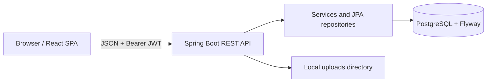

# Architecture

The React 19 single-page app is built by Vite and uses React Router routes for public, applicant, provider, and admin areas. It calls the Java 21/Spring Boot API directly with `fetch`. Spring MVC controllers delegate to services, which contain business workflow logic and perform ownership checks for several user-owned resources before using Spring Data JPA repositories. Flyway owns the PostgreSQL schema; Hibernate validates it rather than generating DDL.

For a protected request, the browser sends `Authorization: Bearer <access token>`. `JwtAuthenticationFilter` validates the token and maps its role claim to `ROLE_APPLICANT`, `ROLE_PROVIDER`, or `ROLE_ADMIN`; Spring Security then matches role-specific route prefixes. Services also perform resource ownership checks. Refresh tokens are stored only as SHA-256 hashes and are rotated.

`SkillBasedMatchingStrategy` is the only implemented and active recommendation strategy. Configuration properties reserve OpenAI and Ollama connection settings, but no OpenAI/Ollama strategy bean or API client is implemented. No mail delivery integration is implemented; registration logs a verification token instead. See [backend](backend.md), [database](database.md), and [authentication](authentication.md).
