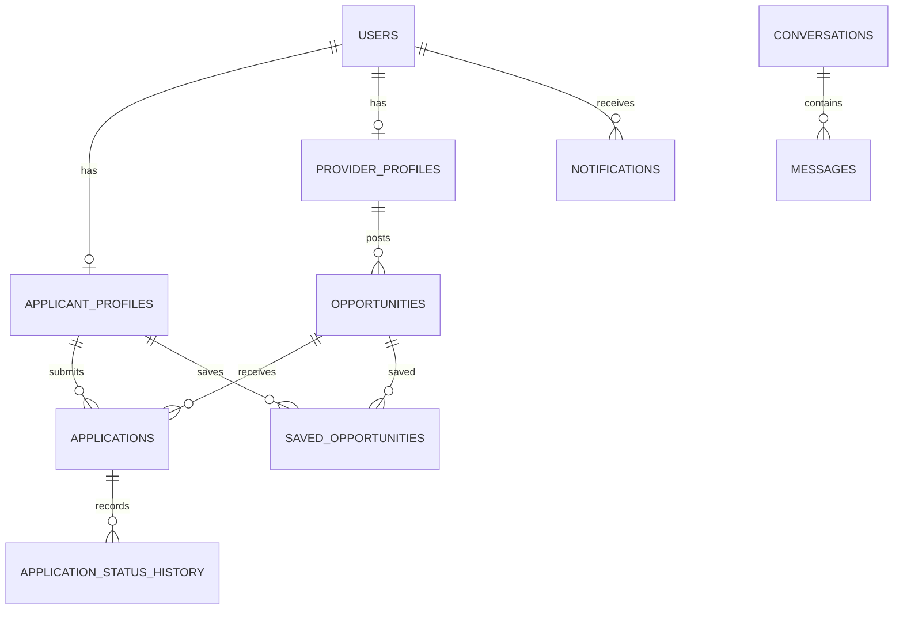

# Database

PostgreSQL is the application's configured relational database; Compose and Testcontainers use `postgres:16-alpine`. Flyway runs `V1`–`V13` in `backend/src/main/resources/db/migration`; Hibernate runs with `ddl-auto: validate`.

Core tables include `users`, shared-primary-key `applicant_profiles`/`provider_profiles`, reference `sectors`, `nqf_levels`, `qualification_types`, and `skills`; opportunity tables (`opportunities`, requirements, skills, and qualifications); application/status history; notifications/preferences; audit and saved reports; refresh tokens; saved opportunities; conversations/messages. Migration V8 supplies reference data. V7 creates reporting/matching views, including application volume, sector placement success, status funnel, and applicant-opportunity match scores; `OpportunityMatchScore` maps the matching view rather than a table.

Important constraints include unique user email, 13-digit unique applicant ID when provided, one application per applicant/opportunity, one saved opportunity pair, and a conversation uniqueness constraint. Indexes target user/profile lookups, application status/ownership, notifications, refresh tokens, messages, and reporting joins. The PostgreSQL migrations also create triggers and functions; H2 migration copies are not a substitute for the full PostgreSQL feature set. See [installation](installation.md).
